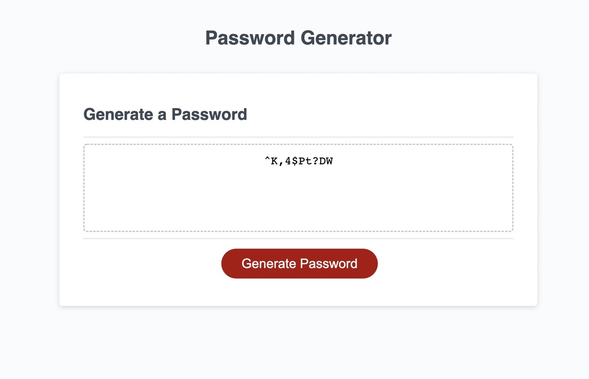

# Password Generator
This is the password generator that I created using HTML, CSS, and Javascript. I used pseudocode to help me plan the steps to creating the program. I used the **function generatePassword()** to put all the code that will retrieve all the selected components that will generate a unique password based on the user's selected criteria. I started by prompting the user to enter a password with the desired length for the password. If the user does not select a length between 8-128 it will alert the user that it is an invalid input. The user will then be asked where they want uppercases, lowercases, numbers, or special characters. The user will only be required to enter one character type for the password to generate, otherwise if nothing is selected they will be alerted that it is required to select at least one character type.
If you would like to take a look at my password generator you can by clicking <a href="https://lamachad.github.io/My-ProFolio-WK2/">here!</a>

